# FilmiQ — LLM Movie Advisor

FilmiQ is a web platform for browsing movies and TV shows, managing a user
profile, storing conversations, and tracking interactions with titles. The
application imports its catalog from [The Movie Database (TMDB)](https://www.themoviedb.org/)
and stores application data in PostgreSQL.

The implemented application includes a React frontend, a Django backend,
session-based authentication, TMDB catalog synchronization, user profiles,
conversations, interactions, PostgreSQL with pgvector, Redis, Docker Compose,
an AMD ROCm-backed Ollama runtime, and automated tests.

The database schema and frontend contain the foundations for an LLM-based
recommendation workflow. Docker Compose runs Ollama and downloads Llama 3.1
8B into a persistent volume. The React chat exchanges temporary messages with
the local model through Django. Django grounds the model with catalog, profile,
preference, and interaction data from PostgreSQL and caches catalog candidates
in Redis. Structured recommendation runs, vector search, and recommendation
agents are not yet implemented.

## Application screenshots

The screenshots below present the main application flows. Select an image to
open it at full resolution.

### Authentication and recommendation advisor

| Sign in | Recommendation advisor |
|:---:|:---:|
| [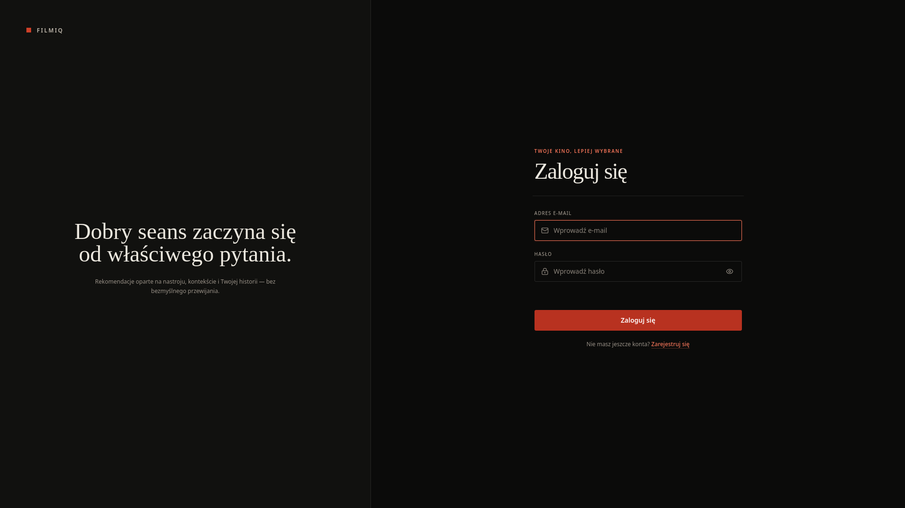](scr/1.png) | [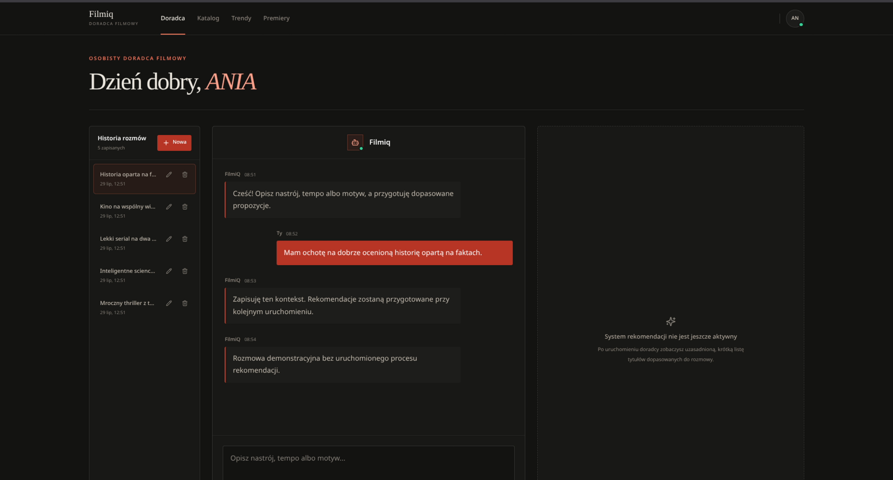](scr/2.png) |

### Catalog and discovery

[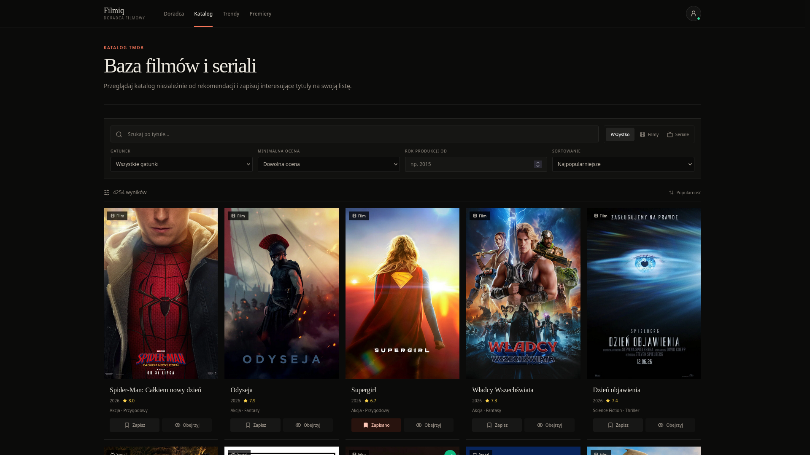](scr/3.png)

| Recommendation trends | Upcoming releases |
|:---:|:---:|
| [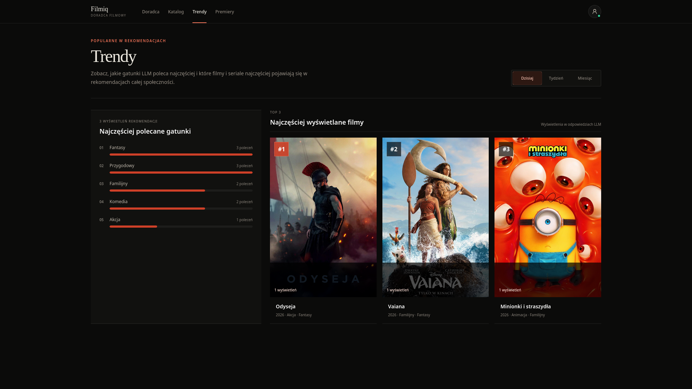](scr/4.png) | [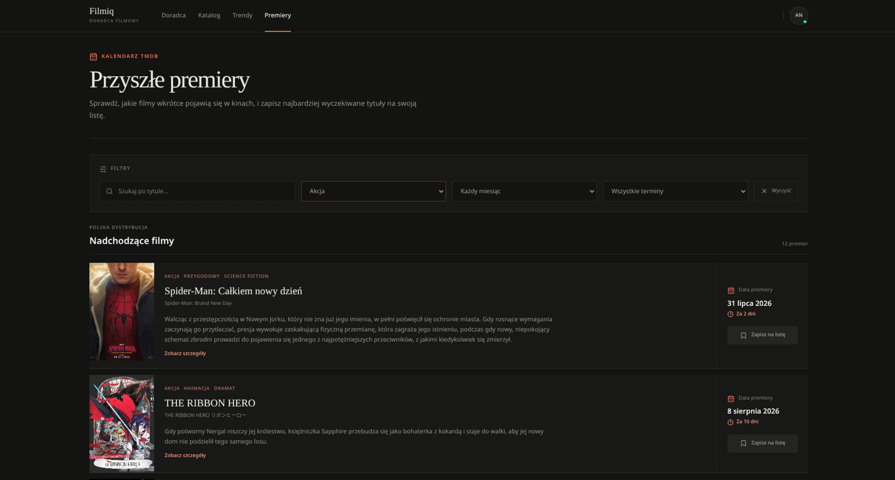](scr/5.png) |

### Personal library and profile

| Watchlist | User profile |
|:---:|:---:|
| [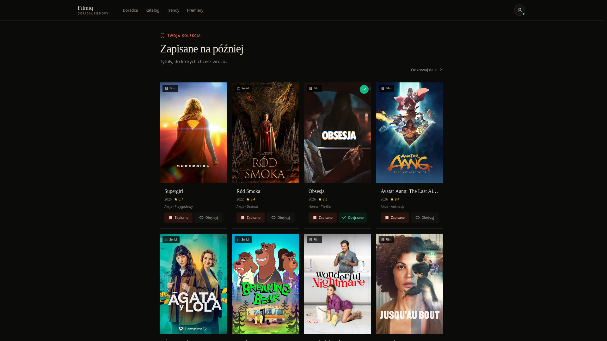](scr/7.png) | [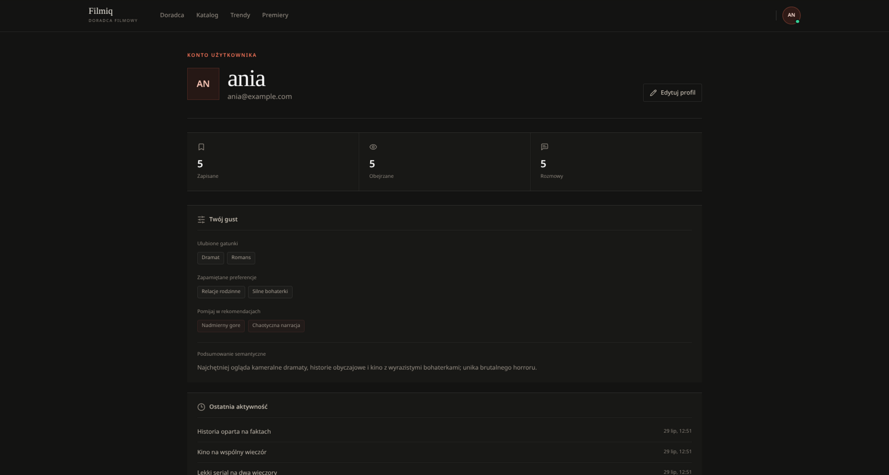](scr/6.png) |

### Viewing analytics

| Activity overview | Genre map |
|:---:|:---:|
| [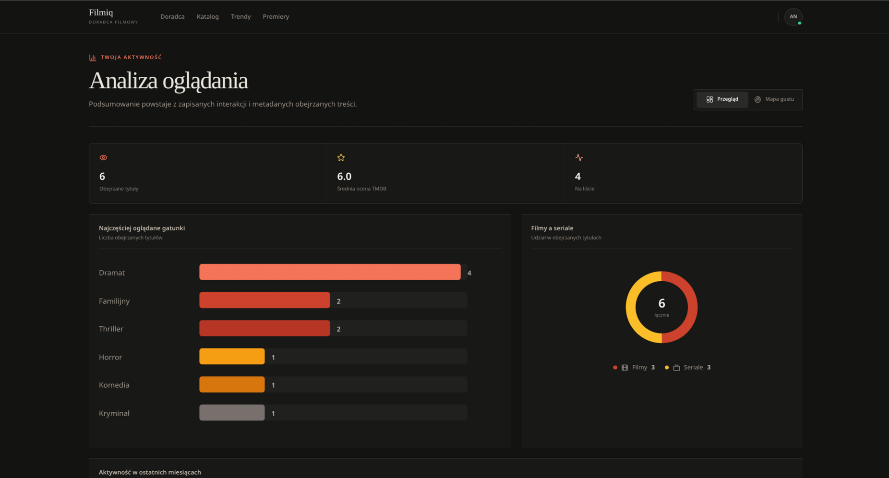](scr/8.png) | [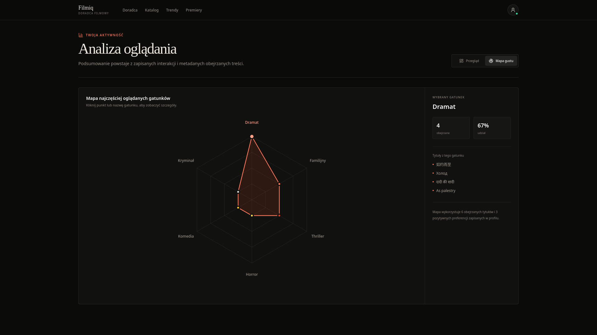](scr/9.png) |

## Table of contents

- [Application screenshots](#application-screenshots)
- [Features](#features)
- [Architecture](#architecture)
- [Technology stack](#technology-stack)
- [Quick start with Docker Compose](#quick-start-with-docker-compose)
- [Environment configuration](#environment-configuration)
- [Ollama runtime](#ollama-runtime)
- [TMDB catalog](#tmdb-catalog)
- [Demo data](#demo-data)
- [Backend and API](#backend-and-api)
- [Frontend](#frontend)
- [Data model](#data-model)
- [Redis and caching](#redis-and-caching)
- [PostgreSQL and pgvector](#postgresql-and-pgvector)
- [Management commands](#management-commands)
- [Tests and quality checks](#tests-and-quality-checks)
- [Security](#security)
- [Production deployment](#production-deployment)
- [Recommendation system scope](#recommendation-system-scope)
- [Known limitations](#known-limitations)
- [Common operations](#common-operations)
- [License](#license)

## Features

### User accounts and activity

- account registration, login, and logout;
- Django sessions with CSRF protection;
- user profile and preference storage;
- semantic profile summary storage;
- conversations and user messages;
- watchlist and watched-title views;
- interactions for opening details, liking, disliking, adding to the
  watchlist, marking as watched, and rating;
- Django administration panel.

### Catalog

- movies and TV shows imported from TMDB;
- a baseline of at least 2,000 released movies and 2,000 released TV shows;
- synchronization of recent releases every six hours;
- synchronization of upcoming movies;
- PostgreSQL-backed search, filtering, sorting, and pagination;
- Redis caching of complete catalog pages returned to the frontend;
- a shared taxonomy for movie and TV genres;
- poster and backdrop path storage;
- a separate upcoming-release view;
- automatic catalog visibility when a title reaches its release date.

### Infrastructure

- PostgreSQL 17 with pgvector;
- Redis with AOF persistence;
- catalog and TMDB response caching;
- Redis-backed Django sessions with a persistent PostgreSQL fallback;
- a distributed catalog synchronization lock;
- an AMD ROCm-backed Ollama service with persistent model storage;
- an idempotent one-shot service that downloads the configured LLM;
- seven Docker Compose services, including one-shot model and demo-data
  initializers;
- a multi-stage application image;
- Gunicorn and WhiteNoise;
- an unprivileged `app` user in the application container;
- health checks for PostgreSQL, Redis, Ollama, and the application.

### Quality

- backend unit and integration tests;
- API and management-command tests;
- frontend security and session tests;
- TypeScript validation;
- ESLint;
- a production React/Vite build.

## Architecture

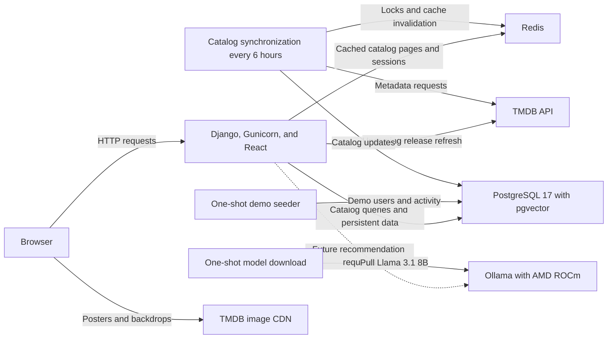

Docker Compose runs these services:

| Service | Responsibility | Host access |
|---|---|---|
| `app` | Django, Gunicorn, API, and the built React frontend | `127.0.0.1:8000` by default |
| `catalog-sync` | initial catalog population and periodic TMDB synchronization | no public port |
| `postgres` | persistent application data and pgvector | Compose network only |
| `redis` | ready-to-display catalog page cache, TMDB response cache, synchronization locks, and fast session reads | Compose network only |
| `ollama` | local LLM runtime accelerated through AMD ROCm | Compose network only |
| `ollama-init` | one-shot download of the configured chat model | no public port; exits after completion |
| `demo-seed` | waits for the catalog and idempotently prepares demo users and activity on every Compose start | no public port; exits after completion |

PostgreSQL, Redis, and Ollama use the named volumes `postgres_data`,
`redis_data`, and `ollama_data`. Recreating containers preserves their data
and downloaded models unless the volumes are explicitly removed.

## Technology stack

### Backend

- Python 3.13;
- Django 6.0.7;
- Psycopg 3;
- Gunicorn 26;
- WhiteNoise;
- pgvector for Django;
- Redis client for Python.

### Frontend

- React 18;
- TypeScript 5.6;
- Vite 6;
- Tailwind CSS 3;
- Lucide React;
- Vitest;
- Testing Library;
- ESLint 9.

### Data and infrastructure

- PostgreSQL 17;
- `pgvector/pgvector:0.8.2-pg17-bookworm`;
- Redis 8.2.8 Alpine;
- Ollama 0.32.3 ROCm;
- Llama 3.1 8B, downloaded at runtime;
- Docker and Docker Compose;
- TMDB API.

## Quick start with Docker Compose

### Requirements

The host needs:

- Docker Engine;
- the Docker Compose plugin;
- an AMD GPU supported by Ollama through ROCm;
- working host AMD GPU drivers exposing `/dev/kfd` and `/dev/dri`;
- the project source code;
- a TMDB API key or access token.

PostgreSQL, Redis, Ollama, Python, and Node.js run in containers and do not
need to be installed directly on the host. This Compose configuration targets
an AMD ROCm host; CPU-only and NVIDIA hosts require a different Ollama service
configuration.

### 1. Configure the environment

```bash
cp .env.example .env
```

Set at least:

```env
DJANGO_SECRET_KEY="a-long-random-secret"
DJANGO_DEBUG="False"
DJANGO_ALLOWED_HOSTS="localhost,127.0.0.1,[::1]"

POSTGRES_DB="movie_advisor"
POSTGRES_USER="movie_advisor"
POSTGRES_PASSWORD="a-strong-password"
SEED_USER_PASSWORD="a-strong-demo-account-password"

TMDB_API_KEY="your-tmdb-key"
```

`SEED_USER_PASSWORD` is required by the automatic `demo-seed` service. Replace
the placeholder from `.env.example` with a strong password before starting
Compose.

### 2. Validate the Compose configuration

```bash
docker compose config --quiet
```

No output and exit code `0` indicate valid syntax and the presence of required
Compose values.

### 3. Build and start

```bash
docker compose up -d --build
```

On a new environment, Compose:

1. builds the frontend in a Node.js image;
2. builds the Django image on Python 3.13;
3. starts PostgreSQL, Redis, and the ROCm-backed Ollama server;
4. downloads `llama3.1:8b` into the persistent `ollama_data` volume;
5. initializes the business schema on a new PostgreSQL volume;
6. applies Django migrations;
7. starts Gunicorn;
8. starts `catalog-sync` after the application becomes healthy;
9. populates at least 2,000 released movies and 2,000 released TV shows;
10. synchronizes recent and upcoming releases;
11. runs `demo-seed` after at least three catalog items are available.

The first model download is approximately 4.9 GB. The initial catalog import
also makes many TMDB requests. Both operations can take longer than subsequent
starts.

### 4. Check service health

```bash
docker compose ps
docker compose logs --tail=100 app
docker compose logs --tail=100 catalog-sync
docker compose logs --tail=100 demo-seed
docker compose logs --tail=100 ollama
docker compose logs --tail=100 ollama-init
```

Expected state:

- `app`, `postgres`, `redis`, and `ollama` are healthy;
- `catalog-sync` is running;
- `demo-seed` has exited successfully with code `0`;
- `ollama-init` has exited successfully with code `0`;
- the application responds on port `8000`.

Health endpoint:

```bash
curl http://localhost:8000/api/health/
```

Example response:

```json
{
  "status": "ok",
  "services": {
    "database": "ok",
    "redis": "ok",
    "ollama": "ok"
  }
}
```

A `degraded` status means Redis or Ollama is unavailable while PostgreSQL
remains available. Ollama reports `model_missing` when its HTTP service works
but the configured chat model is not downloaded. An unavailable PostgreSQL
instance produces HTTP `503` with an `unavailable` status.

### 5. Application URLs

- application: <http://localhost:8000>;
- login: <http://localhost:8000/login>;
- registration: <http://localhost:8000/register>;
- catalog: <http://localhost:8000/catalog>;
- upcoming releases: <http://localhost:8000/upcoming>;
- watchlist: <http://localhost:8000/watchlist>;
- analytics: <http://localhost:8000/analytics>;
- profile: <http://localhost:8000/profile>;
- Django admin: <http://localhost:8000/admin/>;
- health endpoint: <http://localhost:8000/api/health/>.

`0.0.0.0` is the server bind address rather than the preferred browser
destination. Use <http://localhost:8000> on the machine running Compose.

## Environment configuration

### Django and HTTP

| Variable | Default | Purpose |
|---|---:|---|
| `DJANGO_SECRET_KEY` | none | required Django secret |
| `DJANGO_DEBUG` | `True` in Django settings, `False` in Compose | debug mode |
| `DJANGO_ALLOWED_HOSTS` | local hosts | allowed HTTP hosts |
| `DJANGO_CSRF_TRUSTED_ORIGINS` | empty | trusted CSRF origins |
| `DJANGO_SECURE_SSL_REDIRECT` | `False` in Compose | redirect HTTP to HTTPS |
| `DJANGO_SECURE_COOKIES` | `False` in Compose | secure session and CSRF cookies |
| `DJANGO_HSTS_SECONDS` | `0` in Compose | HSTS duration |
| `DJANGO_HSTS_INCLUDE_SUBDOMAINS` | `False` in Compose | HSTS for subdomains |
| `DJANGO_HSTS_PRELOAD` | `False` | HSTS preload flag |
| `DJANGO_TRUST_X_FORWARDED_PROTO` | `False` | trust the reverse proxy protocol header |
| `DJANGO_MAX_REQUEST_BYTES` | `2097152` | maximum request size |
| `DJANGO_LOG_LEVEL` | `INFO` | application log level |
| `DJANGO_REQUEST_LOG_LEVEL` | `ERROR` locally, `WARNING` in Compose | request log level |

### PostgreSQL

| Variable | Default | Purpose |
|---|---:|---|
| `POSTGRES_DB` | none | database name |
| `POSTGRES_USER` | none | database user |
| `POSTGRES_PASSWORD` | none | database password |
| `POSTGRES_HOST` | set by Compose | database host |
| `POSTGRES_PORT` | `5432` | database port |
| `POSTGRES_CONN_MAX_AGE` | `60` | persistent connection lifetime |

### Redis

| Variable | Default | Purpose |
|---|---:|---|
| `REDIS_URL` | `redis://127.0.0.1:6379/1` | Redis logical database URL |
| `REDIS_LOCK_TIMEOUT` | `120` | short synchronization lock duration |
| `REDIS_LOCK_BLOCKING_TIMEOUT` | `5` | lock acquisition wait time |
| `TMDB_CATALOG_LOCK_TIMEOUT` | `1800` | catalog import lock duration |
| `CATALOG_SEARCH_CACHE_TIMEOUT` | `600` | catalog response TTL |

### TMDB and catalog

| Variable | Default | Purpose |
|---|---:|---|
| `TMDB_API_KEY` | empty | TMDB API v3 key |
| `TMDB_API_TOKEN` | empty | alternative TMDB API v4 token |
| `TMDB_BASELINE_MOVIES` | `2000` | minimum number of released movies |
| `TMDB_BASELINE_TV_SHOWS` | `2000` | minimum number of released TV shows |
| `TMDB_SYNC_INTERVAL_SECONDS` | `21600` | six-hour synchronization interval |
| `TMDB_SYNC_DAYS_BACK` | `30` | recent-release lookback window |
| `TMDB_SYNC_MAX_PAGES` | `10` | page limit per content type |
| `TMDB_UPCOMING_DAYS_AHEAD` | `365` | upcoming movie window |
| `TMDB_UPCOMING_MAX_PAGES` | `10` | upcoming movie page limit |

### Ollama

| Variable | Default | Purpose |
|---|---:|---|
| `OLLAMA_IMAGE_TAG` | `0.32.3-rocm` | pinned Ollama image variant for AMD ROCm |
| `OLLAMA_CHAT_MODEL` | `llama3.1:8b` | model downloaded by `ollama-init` and selected by Django |
| `OLLAMA_EMBEDDING_MODEL` | `nomic-embed-text:latest` | 768-dimensional model downloaded by `ollama-embed-init` |
| `OLLAMA_EMBEDDING_DIMENSIONS` | `768` | dimensions required by the current pgvector schema |
| `OLLAMA_KEEP_ALIVE` | `10m` | time an idle model remains loaded |
| `OLLAMA_CONTEXT_LENGTH` | `8192` | default context window and associated VRAM allocation |
| `OLLAMA_MAX_LOADED_MODELS` | `2` | maximum simultaneously loaded chat and embedding models |
| `OLLAMA_NUM_PARALLEL` | `1` | parallel requests processed by one model |
| `OLLAMA_REQUEST_TIMEOUT_SECONDS` | `120` | Django-to-Ollama chat request timeout |
| `OLLAMA_HEALTH_TIMEOUT_SECONDS` | `2` | short timeout used when checking Ollama and the selected model |
| `OLLAMA_TEMPERATURE` | `0.4` | response randomness passed to the chat model |
| `OLLAMA_TOP_P` | empty | optional nucleus-sampling threshold |
| `OLLAMA_TOP_K` | empty | optional size of the token candidate pool |
| `OLLAMA_NUM_PREDICT` | empty | optional generated-token limit |
| `OLLAMA_REPEAT_PENALTY` | empty | optional repetition penalty |
| `LLM_CATALOG_CONTEXT_CACHE_TIMEOUT` | `300` | Redis TTL for catalog candidates passed to the model |
| `LLM_CATALOG_CANDIDATE_LIMIT` | `12` | maximum catalog candidates included in model context |
| `LLM_CATALOG_OVERVIEW_MAX_LENGTH` | `600` | maximum overview characters per candidate |
| `LLM_CATALOG_SEARCH_TERM_LIMIT` | `10` | maximum relational search terms |
| `LLM_USER_PREFERENCE_LIMIT` | `20` | maximum user preferences included in context |
| `LLM_USER_INTERACTION_LIMIT` | `20` | maximum recent user interactions included in context |
| `LLM_PROFILE_SUMMARY_MAX_LENGTH` | `1500` | maximum semantic-profile characters included in context |
| `LLM_PREFERENCE_VALUE_MAX_LENGTH` | `300` | maximum characters included for one preference |
| `LLM_EMBEDDING_MODEL_VERSION` | `v1` | version of the embedding text-construction pipeline |
| `LLM_EMBEDDING_SOURCE_LANGUAGE` | `pl-PL` | embedding source language label |
| `LLM_EMBEDDING_BATCH_SIZE` | `32` | texts sent in one Ollama embed request |
| `LLM_EMBEDDING_SYNC_LOCK_TIMEOUT` | `3600` | Redis lock duration for one embedding sync |
| `LLM_SEMANTIC_SEARCH_ENABLED` | `True` | enable pgvector retrieval for chat grounding |
| `LLM_SEMANTIC_MIN_SIMILARITY` | `0.2` | minimum cosine similarity for semantic candidates |

Compose supplies `OLLAMA_BASE_URL=http://ollama:11434` directly to the
application container. The hostname is only meaningful on the Compose network
and does not need to be added to `.env`.

Model and generation parameters have a single source of truth in `.env`.
Empty optional generation parameters are omitted from the Ollama request, so
the selected model retains its own default for them.

### Application process

| Variable | Default | Purpose |
|---|---:|---|
| `APP_PORT` | `8000` | application port exposed on the host loopback interface |
| `GUNICORN_WORKERS` | `3` | Gunicorn worker count |
| `GUNICORN_TIMEOUT` | `180` | worker timeout long enough for a local model response |
| `SEED_USER_PASSWORD` | required | demo account password used by `demo-seed` |
| `VITE_API_BASE_URL` | `/api` | frontend API base path selected at build time |

Do not commit secrets. Git and the Docker build context ignore `.env` files.

`VITE_API_BASE_URL` is evaluated while Vite builds the frontend. The current
Dockerfile and Compose configuration use `/api` and do not forward this
variable from the root `.env` file into the image build.

## Ollama runtime

The `ollama` service uses the official ROCm image and receives the host GPU
through `/dev/kfd` and `/dev/dri`. It has no published host port; Django and
`ollama-init` reach it over the private Compose network.

The `ollama-init` and `ollama-embed-init` services wait for Ollama to become
healthy, pull the chat and embedding models, and exit. Ollama stores downloaded
layers in the `ollama_data` volume, so unchanged models are reused on later
starts.

Django includes a minimal HTTP client for model discovery and non-streaming
chat calls. The application chat sends its current prompt and up to ten recent
messages to `POST /api/chat/`. Before calling Ollama, Django loads the signed-in
user's profile, preferences, and recent interactions from PostgreSQL. It embeds
the query with Ollama and retrieves a bounded candidate list through pgvector
cosine distance and the HNSW index. Keyword retrieval fills missing results and
acts as a fallback. Candidate lists are cached in Redis and invalidated through
the existing catalog version. Redis failures fall back to PostgreSQL. The
prompt and response remain only in React memory and disappear after a page
reload; this preliminary flow does not create `message`,
`recommendation_request`, or `recommendation_run` records.

Check the complete application health response:

```bash
curl http://localhost:8000/api/health/
```

Send one manual test message through Django:

```bash
docker compose exec app \
  python manage.py ollama_chat "Poleć krótki thriller z mocnym twistem."
```

This command verifies the integration and returns the model's raw text. It
does not query the application catalog, create a conversation, or persist a
recommendation run.

List downloaded models:

```bash
docker compose exec ollama ollama list
```

Run a minimal generation before the Django recommendation pipeline exists:

```bash
docker compose exec ollama \
  ollama run llama3.1:8b "Odpowiedz jednym słowem: działa?"
```

While the model is loaded, verify GPU offloading:

```bash
docker compose exec ollama ollama ps
```

The `PROCESSOR` column should report `100% GPU`. Ollama logs should identify
the RX 9070 XT as `gfx1201`. A CPU value means that GPU devices, host drivers,
or container permissions need attention before recommendation integration.

To download a changed `OLLAMA_CHAT_MODEL` without restarting the full stack:

```bash
docker compose run --rm ollama-init
```

Pull a changed embedding model:

```bash
docker compose run --rm ollama-embed-init
```

## TMDB catalog

Catalog synchronization is implemented by:

- `backend/tmdb.py` — TMDB client and response normalization;
- `backend/api/catalog_sync.py` — PostgreSQL persistence;
- `sync_tmdb_catalog` — Django synchronization command;
- `sync_content_embeddings` — incremental Ollama/pgvector synchronization;
- `catalog-sync` — periodic Compose service that runs catalog and embedding
  synchronization.

### Catalog display flow

The catalog view uses Redis directly through the backend's cache-aside flow:

1. the React frontend calls `GET /api/contents/` with the selected page,
   search term, filters, and sorting;
2. Django validates and normalizes those parameters and uses them to build a
   versioned Redis cache key;
3. on a cache hit, Django returns the complete cached response to the
   frontend, including the movie and TV show items, pagination data, and
   available genres;
4. on a cache miss, Django queries PostgreSQL, serializes the requested
   catalog page, returns it to the frontend, and stores the complete response
   in Redis for `CATALOG_SEARCH_CACHE_TIMEOUT` seconds (`600`, or 10 minutes,
   by default);
5. a successful TMDB catalog write increments the cache version after the
   database transaction commits, so subsequent requests receive refreshed
   catalog data.

Redis therefore accelerates the display of movies and TV shows in the
catalog, especially for repeated combinations of pages, searches, filters,
and sorting. PostgreSQL remains the authoritative catalog store. If Redis is
unavailable, the request falls back to PostgreSQL and the catalog remains
usable.

### Baseline population

The synchronization command establishes the configured catalog baseline:

1. it counts released movies and TV shows;
2. it fetches popular movies until `TMDB_BASELINE_MOVIES` is satisfied;
3. it fetches popular TV shows until `TMDB_BASELINE_TV_SHOWS` is satisfied;
4. it skips records without a date and records with a future release date;
5. it skips the large baseline import when the configured minimum is already
   satisfied.

The baseline is a minimum, not an exact final count. Recent-release
synchronization can add further records.

### Recent releases

Every six hours, the synchronizer imports:

- movies released between 30 days ago and the current date;
- TV shows first aired during the same period;
- up to 10 result pages per content type.

The moving windows intentionally overlap. This refreshes corrected metadata
and reduces the chance of missing a title after a temporary failure.

### Upcoming movies

Each synchronization cycle also imports upcoming movies:

- from the current date;
- up to 365 days ahead by default;
- up to 10 TMDB result pages.

`GET /api/contents/upcoming/` performs a lazy two-page refresh from
`/movie/upcoming` when PostgreSQL has no fresh data. The `refresh=1` query
parameter forces a new fetch.

### Persistence and idempotency

A title is uniquely identified by:

```text
tmdb_id + media_type
```

Synchronization performs an upsert:

- new titles are inserted;
- existing titles are updated;
- genre relationships are rebuilt;
- `tmdb_refreshed_at` is updated;
- the catalog cache is logically invalidated.

The process retains older records and does not create duplicate records for
the same `tmdb_id + media_type` pair.

### Release visibility

`GET /api/contents/` returns records whose `release_date` is not later than
the current date. Future records remain in PostgreSQL and appear through the
upcoming endpoint.

The current date is part of the catalog cache key, so a title becomes visible
in the regular catalog on its release date without depending on a cache entry
created on the previous day.

The technical `GET /api/contents/?ids=...` query can include future records.
This keeps future titles available when they are present on a user's list.

### Genres and images

TMDB uses separate genre dictionaries for movies and TV shows. The backend
maps both dictionaries to a shared taxonomy. Composite categories such as
`Sci-Fi & Fantasy` map to the canonical `Science Fiction` and `Fantasy`
genres.

The database stores TMDB image paths rather than image files. Browsers load
posters and backdrops directly from the TMDB CDN, for example:

```text
https://image.tmdb.org/t/p/w780/<poster_path>
```

## Demo data

`docker compose up --build` starts the one-shot `demo-seed` service every
time. It waits until migrations are complete and the TMDB catalog contains at
least three items, runs the idempotent seeder with `DJANGO_DEBUG=True`, and
then exits successfully. Follow its progress with:

```bash
docker compose logs -f demo-seed
```

```bash
python manage.py seed_demo_data
```

The command requires an existing catalog with at least three titles. It
creates or updates:

- an administrator account;
- up to five demo accounts;
- profiles and preferences;
- conversations and messages;
- demo recommendation requests and runs;
- candidates and agent execution records;
- user interactions.

The seeded recommendation records are fixtures for presenting and testing the
interface and data model. They are not LLM output. The command does not import
or update movies, TV shows, or genres.

Run it in Docker with debug mode enabled:

```bash
docker compose exec -e DJANGO_DEBUG=True app \
  python manage.py seed_demo_data \
  --password 'StrongPassword123!'
```

Alternatively, set a strong `SEED_USER_PASSWORD` in `.env` and omit the
`--password` argument:

```bash
docker compose exec -e DJANGO_DEBUG=True app \
  python manage.py seed_demo_data --users 2
```

The seeder is restricted to `DEBUG=True`; only the isolated `demo-seed`
container overrides this setting automatically.

## Backend and API

The backend uses Django ORM with PostgreSQL.

### Authentication

Django's `auth_user` table handles authentication. Registration and login
create or update the corresponding `app_user` business record. The frontend
uses a session cookie and the `X-CSRFToken` header.

| Method | Endpoint | Access | Purpose |
|---|---|---|---|
| `GET` | `/api/auth/csrf/` | public | set the CSRF cookie |
| `POST` | `/api/auth/register/` | public | create an account and sign in |
| `POST` | `/api/auth/login/` | public | sign in with email and password |
| `GET` | `/api/auth/session/` | public | return the active session state |
| `POST` | `/api/auth/logout/` | authenticated | sign out |

### Application data

Application-data endpoints require an authenticated session, except for the
health endpoint.

| Method | Endpoint | Purpose |
|---|---|---|
| `GET` | `/api/health/` | report PostgreSQL, Redis, Ollama, and model status |
| `POST` | `/api/chat/` | return a temporary response from the local chat model without database persistence |
| `GET` | `/api/bootstrap/` | return initial data for the signed-in user |
| `GET` | `/api/contents/` | catalog search, filters, sorting, and pagination |
| `GET` | `/api/contents/upcoming/` | upcoming movie releases |
| `GET` | `/api/recommendation-trends/?period=...` | aggregate stored candidate data |
| `PATCH` | `/api/profile/` | update username and email |
| `DELETE` | `/api/profile/preferences/` | clear learned preferences and the semantic profile summary |
| `GET` | `/api/conversations/` | list conversations |
| `POST` | `/api/conversations/` | create a conversation |
| `PATCH` | `/api/conversations/:id/` | rename a conversation |
| `DELETE` | `/api/conversations/:id/` | delete a conversation |
| `POST` | `/api/conversations/:id/messages/` | store a user message |
| `POST` | `/api/interactions/` | store a title interaction |
| `DELETE` | `/api/interactions/:id/` | delete the user's interaction |

`GET /api/bootstrap/` provides the frontend with the user, profile,
preferences, conversations, messages, and interactions. It is unrelated to
the catalog baseline process and the Bootstrap CSS framework.

### Catalog query parameters

`GET /api/contents/` supports:

- `page`;
- `page_size`, with a maximum of 50;
- `q` for title search;
- `media_type`: `all`, `movie`, or `tv`;
- `genre`;
- `min_rating`;
- `year_from`;
- `sort`;
- `ids` for fetching a specified list of identifiers.

### Recommendation data

`RecommendationRequest`, `RecommendationRun`, `RunCandidate`, and
`AgentExecution` provide persistence for recommendation-related data. The API
does not execute a recommendation pipeline. Posting a message stores it in
PostgreSQL without fabricating an assistant response.

## Frontend

The frontend is a React and TypeScript single-page application. Django serves
the production build from `frontend/dist`, and frontend routes resolve to the
same `index.html`.

### Views

- login;
- registration;
- recommendation advisor;
- movie and TV catalog;
- trends;
- upcoming movie releases;
- watchlist;
- analytics;
- profile.

### Main components

| File | Responsibility |
|---|---|
| `App.tsx` | view routing and main application state |
| `SessionContext.tsx` | session, user data, API synchronization, and temporary chat messages |
| `ChatInterface.tsx` | temporary local-model conversation and message form |
| `ConversationManager.tsx` | list, create, rename, and delete conversations |
| `CatalogView.tsx` | catalog search, filters, and pagination |
| `UpcomingReleasesView.tsx` | chronological upcoming-release view |
| `MovieDetailModal.tsx` | title details and user actions |
| `RecommendationCard.tsx` | presentation component for recommendation data |
| `TrendsView.tsx` | trends based on stored recommendation data |
| `AnalyticsView.tsx` | user activity statistics |
| `ProfileView.tsx` | account, profile, and preferences |

Recommendation generation is designed to begin only after the user
explicitly submits text. Navigation, filter changes, opening a title, adding
it to the watchlist, or marking it as watched must not trigger an LLM request.

## Data model

The business schema is defined in:

```text
backend/postgresql_recommendation_platform_schema.sql
```

Django models are defined in `backend/api/models.py`.

### Main entities

| Model or table | Purpose |
|---|---|
| `auth_user` | Django authentication |
| `app_user` | application-level user record |
| `user_profile` | semantic profile summary and version |
| `user_preference` | preference value, polarity, weight, and confidence |
| `conversation` | user conversation |
| `message` | ordered conversation message |
| `recommendation_request` | extracted context and constraints |
| `recommendation_run` | recommendation process state |
| `content` | movie or TV show imported from TMDB |
| `genre` | canonical genre |
| `content_genre` | many-to-many content/genre relation |
| `content_embedding` | 768-dimensional content embedding |
| `run_candidate` | candidate and ranking values |
| `interaction` | user behavior associated with a title |
| `agent_execution` | trace of one agent step |

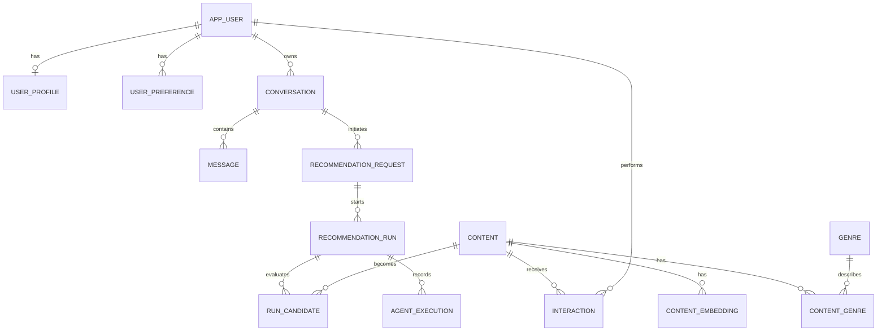

Supported interaction types are:

- `details_opened`;
- `liked`;
- `disliked`;
- `watchlisted`;
- `watched`;
- `rated`.

Only a `rated` interaction accepts a rating, and its value must be between
0 and 10.

The `content_embedding` table and an HNSW index are present in the schema.
The `embedding` column uses `vector(768)`. `sync_content_embeddings` builds a
stable source text, hashes it, generates missing or stale vectors through
Ollama, and stores them with model, pipeline-version, and language metadata.
Chat queries use pgvector cosine distance and fall back to relational search
when semantic retrieval is disabled or unavailable.

## Redis and caching

Redis is an acceleration layer; PostgreSQL remains the authoritative data
store.

Redis provides:

- cache-aside storage for raw `/movie/upcoming` responses;
- complete, ready-to-display `/api/contents/` responses containing catalog
  items, pagination metadata, and available genres;
- version-based catalog cache invalidation;
- cached LLM candidate contexts, including semantic retrieval mode;
- a shared TMDB synchronization lock;
- a shared embedding synchronization lock;
- fast reads for Django sessions;
- PostgreSQL session fallback when the cache is unavailable.

Key formats:

```text
apiTMDB:response:<sha256>
catalog:search:v<version>:<sha256>
llm:catalog-context:v<version>:<sha256>
lock:tmdb:catalog
lock:embeddings:catalog
```

The catalog key includes query parameters and the current date. A successful
TMDB write increments the cache version, which makes stale variants
unreachable without scanning and deleting every key.

`backend.sessions.SessionStore` extends Django's `cached_db` session backend:

1. PostgreSQL stores the persistent session;
2. Redis accelerates reads;
3. cache errors fall back to PostgreSQL;
4. Redis can be repopulated from the persistent session.

If Redis is unavailable, the health endpoint reports `degraded`, catalog
reads can use PostgreSQL, and sessions use their persistent database copy.
Catalog synchronization can continue without the distributed lock.

## PostgreSQL and pgvector

PostgreSQL stores:

- business user records;
- profiles and preferences;
- conversations and messages;
- catalog entries and genres;
- interactions;
- demo recommendation data;
- Django sessions;
- the schema prepared for content embeddings.

For a new Compose volume, PostgreSQL executes:

```text
backend/postgresql_recommendation_platform_schema.sql
```

The script creates the `vector` extension, custom enum types, tables, indexes,
and triggers. It is intended for an empty database because not every statement
is idempotent.

Migration `api.0001_initial` uses `SeparateDatabaseAndState`. It registers the
business models in Django's migration state without recreating the tables from
the initialization script. Regular Django migrations handle subsequent schema
changes.

The graphical ERD is available in
[`PostgreSQL_ERD.png`](PostgreSQL_ERD.png).

## Management commands

### Synchronize the catalog

```bash
python manage.py sync_tmdb_catalog
```

Options:

```text
--baseline-movies
--baseline-tv-shows
--days-back
--max-pages
--upcoming-days-ahead
--upcoming-max-pages
```

Example:

```bash
python manage.py sync_tmdb_catalog \
  --baseline-movies 2000 \
  --baseline-tv-shows 2000 \
  --days-back 30 \
  --max-pages 10 \
  --upcoming-days-ahead 365 \
  --upcoming-max-pages 10
```

This command supports `DEBUG=False`.

### Seed demo data

```bash
python manage.py seed_demo_data --users 5
```

Options:

- `--users`: from 1 to 5;
- `--password`: password used instead of `SEED_USER_PASSWORD`.

This command requires `DEBUG=True`.

### Test the local chat model

```bash
python manage.py ollama_chat "Odpowiedz jednym zdaniem: czy działasz?"
```

The command checks that `OLLAMA_CHAT_MODEL` appears in Ollama's downloaded
model list and then makes one non-streaming chat request. The response text is
written to standard output and basic token metrics to standard error.

### Clear application data

Interactive:

```bash
python manage.py clear_database_data
```

Without confirmation:

```bash
python manage.py clear_database_data --yes
```

Preserve users, profiles, and preferences:

```bash
python manage.py clear_database_data --keep-users
```

The command uses `TRUNCATE ... RESTART IDENTITY CASCADE`, preserves the schema
and migration history, and requires `DEBUG=True`. It clears PostgreSQL but
does not run `FLUSHDB` in Redis.

> **Warning:** clearing data is destructive. Clear the project Redis cache
> separately when performing a complete development-environment reset.

### Development server

The project extends Django's development command:

```bash
python manage.py runserver 8000
```

Before starting the server, it:

1. runs the backend test suite;
2. checks the database schema;
3. runs `sync_tmdb_catalog` when the `content` table is empty;
4. runs the demo seeder after catalog synchronization;
5. starts the development server.

Skip this automation with:

```bash
python manage.py runserver 8000 --skip-bootstrap
```

This behavior applies to the development server, not to Gunicorn in Compose.

## Tests and quality checks

### Backend

```bash
python manage.py test
python manage.py check
```

In Docker:

```bash
docker compose exec app python manage.py test --noinput
docker compose exec app python manage.py check
```

The backend suite covers authentication, sessions, CSRF, ownership checks,
catalog queries, pagination, filtering, caching, upcoming releases, TMDB
normalization, synchronization, Redis locks, conversations, message sequence
numbers, interactions, rating validation, the admin panel, management
commands, and SPA routes.

### Frontend

These commands require Node.js 22.x and npm 10.x on the host. They are
development quality checks; running the application through Docker Compose
does not require a host installation of Node.js or npm.

```bash
npm --prefix frontend test
npm --prefix frontend run lint
npm --prefix frontend run build
```

The frontend suite covers views, API communication, session context, routing,
safe rendering, upcoming releases, and user interactions.

### Docker

```bash
docker compose config --quiet
docker compose up -d --build
docker compose ps
```

## Security

The application implements:

- Django password hashing and password validators;
- session authentication and session-key rotation after login;
- CSRF protection;
- `HttpOnly` and `SameSite=Lax` cookies;
- configurable secure cookies, HTTPS redirects, and HSTS;
- ownership checks for conversations and interactions;
- input validation and request-size limits;
- Django ORM for user-influenced queries;
- WhiteNoise static-file serving;
- an unprivileged application-container user;
- no public PostgreSQL or Redis ports in Compose;
- server-side TMDB credentials;
- frontend XSS tests and React's safe rendering behavior.

The deployment does not include rate limiting, password reset, a Content
Security Policy, Redis authentication/TLS, or LLM-specific safeguards.

## Production deployment

Compose runs Gunicorn. A public deployment also requires a domain, HTTPS, and
a reverse proxy or load balancer.

Minimum production-oriented settings:

```env
DJANGO_DEBUG="False"
DJANGO_SECRET_KEY="a-long-random-secret"
DJANGO_ALLOWED_HOSTS="app.example.com"
DJANGO_CSRF_TRUSTED_ORIGINS="https://app.example.com"
DJANGO_SECURE_SSL_REDIRECT="True"
DJANGO_SECURE_COOKIES="True"
DJANGO_HSTS_SECONDS="31536000"
DJANGO_TRUST_X_FORWARDED_PROTO="True"
```

Run Django's deployment checks:

```bash
docker compose exec app \
  python manage.py check --deploy
```

Do not use `runserver` in production. Place Nginx, Caddy, or a load balancer
in front of the application.

The repository does not provide a public-server definition, TLS certificate
automation, scheduled backups, monitoring, alerting, log retention, rollback
automation, or CI/CD.

## Recommendation system scope

The intended recommendation workflow consists of four roles:

1. a profiling and context step that interprets the user's message,
   conversation history, profile, mood, themes, and constraints;
2. a retrieval step that combines relational filters, PostgreSQL/pgvector,
   and optional TMDB metadata;
3. a ranking and critique step that scores candidates and rejects mismatches;
4. an explanation and interaction step that returns a concise response and
   explains each selected title.

The schema provides `recommendation_request`, `recommendation_run`,
`run_candidate`, and `agent_execution` for storing this workflow. Implementing
the workflow requires:

- using the existing Ollama client in the recommendation workflow;
- defining validated input and output contracts;
- implementing ranking, rejection thresholds, and deterministic validation;
- adding a recommendation API with errors, cancellation, retries, and
  optional streaming;
- connecting the existing frontend components to that API;
- updating persistent preferences separately from a user's temporary mood;
- evaluating recommendation accuracy, diversity, novelty, catalog coverage,
  latency, and hardware requirements.

The configured chat model is Llama 3.1 8B and the embedding model is
`nomic-embed-text:latest`. Changing to a model with dimensions other than 768
requires a coordinated PostgreSQL schema and index migration. Model changes
still require quality, performance, hardware, license, and multilingual-support
evaluation.

## Known limitations

- semantic retrieval has not yet been evaluated against a labeled relevance set;
- the preliminary Ollama chat does not persist messages or recommendation
  runs and loses its temporary messages after a page reload;
- no LangChain or LangGraph integration;
- no automatic semantic-profile updates;
- recommendation trends depend on stored records, which can be demo data;
- recommendation and agent-status components have no live pipeline;
- upcoming releases cover movies, not future TV seasons;
- `catalog-sync` uses a shell loop instead of a scheduler with job history;
- local Redis has no password;
- no rate limiting or password-reset flow;
- no CI/CD or automated monitoring.

## Common operations

### Logs

```bash
docker compose logs -f app
docker compose logs -f catalog-sync
docker compose logs -f demo-seed
docker compose logs -f postgres
docker compose logs -f redis
docker compose logs -f ollama
docker compose logs -f ollama-init
```

### Restart services

```bash
docker compose restart app
docker compose restart catalog-sync
docker compose restart ollama
```

Restarting `catalog-sync` starts synchronization immediately; the process
runs the command before waiting for the next six-hour interval.

### Run synchronization manually

```bash
docker compose exec app python manage.py sync_tmdb_catalog
```

### Seed demo data

```bash
docker compose exec -e DJANGO_DEBUG=True app \
  python manage.py seed_demo_data \
  --password 'StrongPassword123!'
```

### Stop without removing data

```bash
docker compose stop
```

### Remove containers and preserve data

```bash
docker compose down
```

### Reset all Compose data

```bash
docker compose down --volumes
docker compose up -d --build
```

> **Warning:** `down --volumes` permanently deletes this project's PostgreSQL
> and Redis data as well as every model downloaded into `ollama_data`.

### Back up PostgreSQL

```bash
docker compose exec -T postgres \
  sh -c 'pg_dump --format=custom --no-owner -U "$POSTGRES_USER" "$POSTGRES_DB"' \
  > movie_advisor_backup.dump
```

### Restore PostgreSQL

Stop processes that write to the database, restore the backup, and start them
again:

```bash
docker compose stop app catalog-sync
docker compose exec -T postgres \
  sh -c 'pg_restore --clean --if-exists --no-owner -U "$POSTGRES_USER" -d "$POSTGRES_DB"' \
  < movie_advisor_backup.dump
docker compose start app catalog-sync
```

Test the restore procedure in a non-production environment before relying on
it.

## License

This project is available under the MIT License. See [`LICENSE`](LICENSE).
